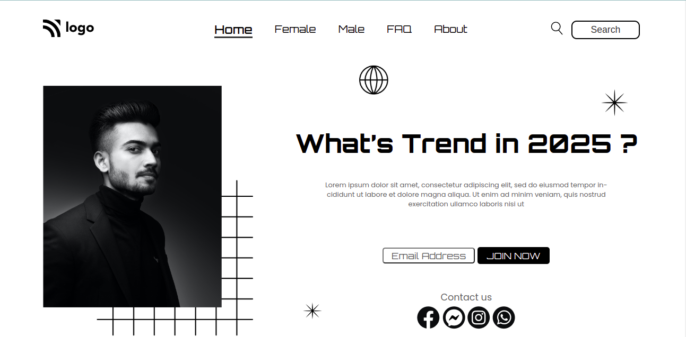

# Project-1

- This is my first website made using HTML and CSS.In this project,i faced difficulty in making the navbar, but the positioning of images were easy for me.This website was made with HTML and CSS

- I am a beginner and so it took me 5-6hr to make this website.Link of my project is attached below:

<<<<<<< HEAD

---

## Screenshot

---

## 🛠 Skills learned

HTML, CSS

---

## 🚀 About Me

### Hey, I am Yasir lambawala

- I am born and brought up in Vadodara, Gujarat. I have done my Btech at GTU university and I am currently learning Web-development.

---

## Feedback

- If you have any feedback, please reach me at lambawalay@gmail.com
=======

>>>>>>> d124c09765c792da127d5fbdabf3ef739ae2890e
